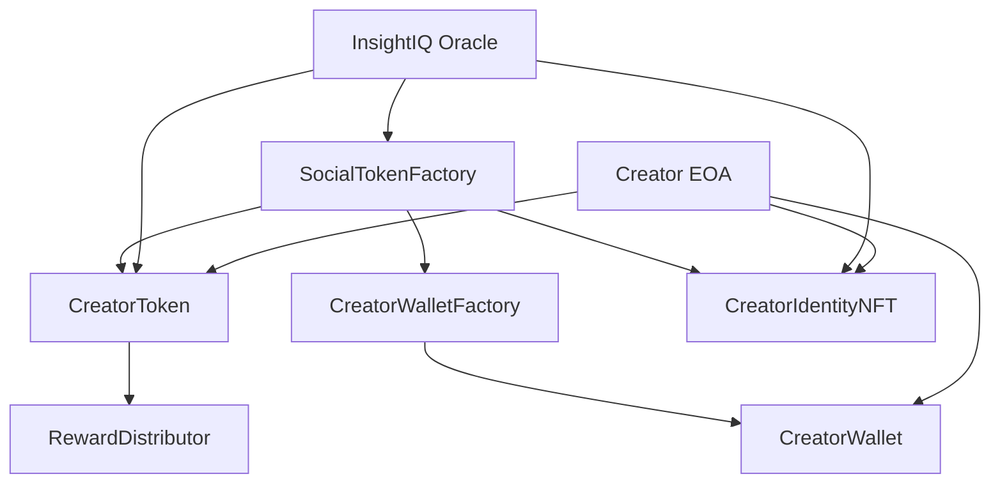
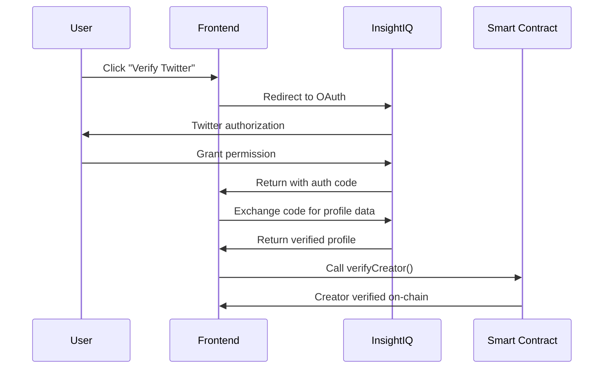
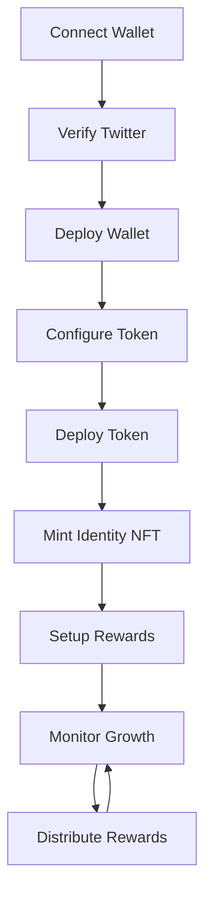

# XMenity Social Token Factory - Architecture Overview

## 🏗️ Integrated Architecture for InsightIQ-Verified Social Tokens on Arbitrum

This document outlines the comprehensive technical architecture for empowering social media creators to launch their own community tokens and rewards on the Arbitrum network, gated by verifiable social engagement milestones.

## 📋 Table of Contents

1. [System Overview](#system-overview)
2. [Key Components](#key-components)
3. [Smart Contract Architecture](#smart-contract-architecture)
4. [Frontend Implementation](#frontend-implementation)
5. [InsightIQ Integration](#insightiq-integration)
6. [Oracle System](#oracle-system)
7. [Security & Permissions](#security--permissions)
8. [Deployment Guide](#deployment-guide)
9. [End-to-End User Flow](#end-to-end-user-flow)
10. [Development Setup](#development-setup)

## 🌟 System Overview

The XMenity Social Token Factory is a modular, secure, and scalable platform that enables verified social media creators to:

- **Deploy custom ERC-20 tokens** with milestone-based minting/burning logic
- **Create smart contract wallets** for asset management on Arbitrum
- **Mint identity NFTs/SBTs** for verified creator credentials
- **Distribute rewards** to followers and community members
- **Track engagement metrics** through InsightIQ integration

### Key Features

- ✅ **InsightIQ Verification**: OAuth integration with Twitter/X for creator identity verification
- ✅ **Milestone-Based Tokenomics**: Automatic token minting based on follower growth and engagement
- ✅ **Smart Contract Wallets**: On-demand deployment of creator-controlled wallets
- ✅ **Soulbound Identity NFTs**: Non-transferable badges for verified creators
- ✅ **Reward Distribution**: Batch airdrops and merkle tree-based claim systems
- ✅ **Arbitrum Native**: Low-cost, high-throughput transactions
- ✅ **Modular Design**: Each component can be upgraded independently

## 🔧 Key Components

### 1. InsightIQ Connect Module (Auth & Data API)

**Purpose**: Handles OAuth login with X (Twitter) and fetches verified profile data.

**Features**:
- OAuth 2.0 flow with InsightIQ
- Real-time engagement metrics
- Anti-Sybil protection through verified social accounts
- Historical data for milestone tracking

**Implementation**: [`lib/insightiq.ts`](lib/insightiq.ts)

### 2. Smart Contract Wallet Factory

**Purpose**: Creates dedicated smart contract wallets for creators on Arbitrum.

**Features**:
- On-demand wallet deployment (only when user confirms)
- Simple execute/batch execute functionality
- Owner-controlled with potential for future upgrades
- Gas-efficient deployment through factory pattern

**Contract**: [`contracts/src/CreatorWalletFactory.sol`](contracts/src/CreatorWalletFactory.sol)

### 3. Social Token Factory

**Purpose**: Deploys custom ERC-20 tokens with milestone-based mechanics.

**Features**:
- Creator verification gating
- Custom name/symbol per creator
- Milestone-based minting/burning logic
- Oracle integration for metric updates
- Deployment fee management

**Contract**: [`contracts/src/SocialTokenFactory.sol`](contracts/src/SocialTokenFactory.sol)

### 4. Creator Token Implementation

**Purpose**: ERC-20 tokens with social media milestone integration.

**Features**:
- Standard ERC-20 functionality
- Follower count-based minting
- Post count-based rewards
- Milestone threshold system
- Oracle-controlled updates only

**Contract**: [`contracts/src/CreatorToken.sol`](contracts/src/CreatorToken.sol)

### 5. Identity NFT/SBT Contract

**Purpose**: Soulbound tokens representing verified creator identities.

**Features**:
- Non-transferable (Soulbound) design
- On-chain SVG generation
- Creator metrics embedded in metadata
- Profile update capabilities
- Verification timestamp tracking

**Contract**: [`contracts/src/CreatorIdentityNFT.sol`](contracts/src/CreatorIdentityNFT.sol)

### 6. Reward Distribution System

**Purpose**: Handles token distribution to followers and community members.

**Features**:
- Direct batch airdrops
- Merkle tree-based claiming
- Campaign management
- Fee-based sustainability model
- Emergency distribution capabilities

**Contract**: [`contracts/src/RewardDistributor.sol`](contracts/src/RewardDistributor.sol)

### 7. Next.js Frontend Application

**Purpose**: Unified dashboard for creators to manage their token ecosystem.

**Features**:
- Step-by-step onboarding flow
- Real-time analytics dashboard
- Token deployment interface
- Reward campaign management
- Multi-tab organization (Setup, Analytics, Rewards, Settings)

**Implementation**: [`app/dashboard/page.tsx`](app/dashboard/page.tsx)

## 🔗 Smart Contract Architecture

### Contract Relationships



### Factory Pattern Benefits

1. **Gas Efficiency**: Deploy heavy logic once, create instances cheaply
2. **Upgradability**: New features can be added to factory without affecting existing tokens
3. **Standardization**: All tokens follow the same verified implementation
4. **Event Tracking**: Centralized events for indexing and monitoring

### Security Model

- **Owner-based Access Control**: Each token is owned by its creator
- **Oracle Authorization**: Only authorized oracles can update metrics
- **Factory Verification**: Only verified creators can deploy tokens
- **Non-transferable Identity**: SBTs cannot be sold or transferred

## 🖥️ Frontend Implementation

### Technology Stack

- **Next.js 15**: App Router with TypeScript
- **Wagmi & RainbowKit**: Web3 wallet integration
- **Thirdweb**: Contract interactions and SDK
- **TailwindCSS + Radix UI**: Modern, accessible UI components
- **Zustand**: State management for complex interactions

### User Interface Flow

1. **Connect Wallet**: MetaMask/WalletConnect integration
2. **Verify Social Account**: InsightIQ OAuth flow
3. **Deploy Wallet**: Smart contract wallet creation
4. **Configure Token**: Custom tokenomics setup
5. **Mint Identity Badge**: Soulbound NFT creation
6. **Setup Rewards**: Community distribution campaigns

### Key Components

- **Multi-step Wizard**: Guided onboarding experience
- **Real-time Status**: Live updates on transaction progress
- **Analytics Dashboard**: Engagement metrics and token performance
- **Campaign Management**: Reward distribution interface

## 🔐 InsightIQ Integration

### Authentication Flow



### Data Integration

- **Profile Verification**: Real Twitter account ownership
- **Engagement Metrics**: Followers, posts, engagement rate
- **Historical Data**: Growth tracking for milestones
- **Real-time Updates**: Webhook notifications for changes

### Security Considerations

- **OAuth 2.0**: Industry-standard authentication
- **Profile Verification**: InsightIQ ensures account authenticity
- **Rate Limiting**: API protection against abuse
- **Data Validation**: On-chain verification of metrics

## ⚡ Oracle System

### Oracle Architecture

The oracle system bridges off-chain social media data with on-chain smart contracts:

1. **Data Collection**: InsightIQ APIs provide verified metrics
2. **Data Validation**: Multiple checkpoints ensure data integrity
3. **On-chain Updates**: Authorized oracle updates contract state
4. **Event Emission**: Contracts emit events for frontend updates

### Oracle Implementation Options

#### Option 1: Chainlink Functions (Recommended)
- **Decentralized**: Multiple node consensus
- **Verifiable**: Cryptographic proofs of data fetching
- **Automated**: Regular update intervals
- **Cost**: LINK token fees

#### Option 2: Custom Oracle Service
- **Centralized**: Platform-controlled oracle
- **Cost-effective**: No external token fees
- **Flexible**: Custom update logic
- **Trust**: Requires trust in platform operator

### Update Mechanisms

- **Follower Count Updates**: Automatic minting when followers increase
- **Post Count Tracking**: Rewards for content creation
- **Milestone Detection**: Automatic threshold crossing detection
- **Batch Updates**: Efficient gas usage through batching

## 🛡️ Security & Permissions

### Access Control Matrix

| Function | Creator | Oracle | Factory Owner | Anyone |
|----------|---------|--------|---------------|--------|
| Deploy Token | ✅ (if verified) | ❌ | ✅ | ❌ |
| Update Metrics | ❌ | ✅ | ❌ | ❌ |
| Mint Tokens | ❌ | ✅ (auto) | ❌ | ❌ |
| Burn Tokens | ✅ | ✅ | ❌ | ❌ |
| Transfer Ownership | ✅ | ❌ | ❌ | ❌ |
| Set Oracle | ✅ | ❌ | ❌ | ❌ |

### Security Mechanisms

1. **Reentrancy Guards**: All state-changing functions protected
2. **Input Validation**: Comprehensive parameter checking
3. **Access Modifiers**: Role-based function access
4. **Emergency Stops**: Admin pause functionality
5. **Upgrade Patterns**: Proxy patterns for future upgrades

### Audit Considerations

- **OpenZeppelin Libraries**: Battle-tested contract components
- **Standard Patterns**: Well-known factory and proxy patterns
- **Event Logging**: Comprehensive audit trail
- **Gas Optimization**: Efficient operations to prevent DoS

## 🚀 Deployment Guide

### Prerequisites

1. **Node.js 18+**: Runtime environment
2. **Hardhat**: Smart contract development framework
3. **Arbitrum Testnet ETH**: For deployment gas fees
4. **Environment Variables**: Configured as per `.env.example`

### Smart Contract Deployment

```bash
# Install dependencies
cd contracts
npm install

# Configure environment
cp .env.example .env
# Edit .env with your configuration

# Deploy to Arbitrum Testnet
npx hardhat run scripts/deploy.js --network arbitrumSepolia

# Verify contracts on Arbiscan
npx hardhat verify --network arbitrumSepolia <CONTRACT_ADDRESS> <CONSTRUCTOR_ARGS>
```

### Frontend Deployment

```bash
# Install dependencies
npm install

# Configure environment
cp .env.example .env.local
# Edit .env.local with contract addresses

# Build and start
npm run build
npm run start
```

### Database Setup

```bash
# Generate Prisma client
npx prisma generate

# Push schema to database
npx prisma db push

# Seed database (optional)
npx prisma db seed
```

## 🎯 End-to-End User Flow

### Alice's Journey: From Creator to Token Launcher

1. **Discovery**: Alice visits XMenity and sees the creator dashboard
2. **Connection**: She connects her MetaMask wallet to Arbitrum
3. **Verification**: Alice verifies her Twitter account (@alice) through InsightIQ
4. **Profile Analysis**: System shows Alice has 50k followers, 1.2k posts
5. **Wallet Creation**: Alice deploys her smart contract wallet
6. **Token Configuration**: 
   - Name: "AliceCoin"
   - Symbol: "ALICE"
   - Rate: 1 token per new follower
   - Posts: 10 tokens per new post
7. **Token Deployment**: Alice pays 0.001 ETH deployment fee
8. **Identity Badge**: Alice mints her verified creator NFT
9. **Community Growth**: Alice gains 1k followers → 1k ALICE tokens minted
10. **Reward Distribution**: Alice airdrops 500 ALICE to her top 10 fans

### Technical Flow



## 💻 Development Setup

### Local Development

```bash
# Clone repository
git clone https://github.com/your-org/xmenity-social-token-factory
cd xmenity-social-token-factory

# Install dependencies
npm install

# Setup environment
cp .env.example .env.local
# Configure environment variables

# Start development server
npm run dev

# Start hardhat node (separate terminal)
cd contracts
npx hardhat node

# Deploy contracts locally (separate terminal)
cd contracts
npx hardhat run scripts/deploy.js --network localhost
```

### Testing

```bash
# Run frontend tests
npm run test

# Run contract tests
cd contracts
npx hardhat test

# Run end-to-end tests
npm run test:e2e
```

### Development Tools

- **Hardhat**: Local blockchain and testing
- **TypeScript**: Type safety across the stack
- **Prettier**: Code formatting
- **ESLint**: Code linting
- **Husky**: Git hooks for quality checks

## 📈 Performance Considerations

### Arbitrum Advantages

- **Low Gas Costs**: ~100x cheaper than Ethereum mainnet
- **High Throughput**: Fast transaction finality
- **EVM Compatibility**: Existing tools and libraries work
- **Ecosystem**: Growing DeFi and NFT ecosystem

### Optimization Strategies

1. **Batch Operations**: Multiple updates in single transaction
2. **Event-Driven UI**: Real-time updates without polling
3. **Caching**: Redis for API responses and metadata
4. **IPFS**: Decentralized storage for NFT metadata
5. **CDN**: Static asset delivery optimization

## 🔮 Future Enhancements

### Phase 2 Features

- **Multi-Platform Support**: Instagram, TikTok, YouTube integration
- **Advanced Tokenomics**: Decay functions, burning mechanisms
- **Governance**: Community voting with tokens
- **Staking**: Rewards for long-term token holders
- **Cross-Chain**: Bridge to other networks

### Phase 3 Features

- **AI-Powered Analytics**: Predictive engagement modeling
- **Automated Market Making**: Built-in token liquidity
- **Creator Collaborations**: Multi-creator token pools
- **Mobile App**: React Native implementation
- **Enterprise Features**: White-label solutions

## 🤝 Contributing

### Development Guidelines

1. **Code Quality**: Follow TypeScript and Solidity best practices
2. **Testing**: Comprehensive test coverage required
3. **Documentation**: Update docs with new features
4. **Security**: Security-first development approach
5. **Gas Optimization**: Efficient contract interactions

### Pull Request Process

1. Fork the repository
2. Create feature branch
3. Implement changes with tests
4. Update documentation
5. Submit pull request with description

## 📞 Support & Resources

- **Documentation**: [docs.xmenity.com](https://docs.xmenity.com)
- **Discord**: [discord.gg/xmenity](https://discord.gg/xmenity)
- **GitHub Issues**: [github.com/xmenity/issues](https://github.com/xmenity/issues)
- **Email**: support@xmenity.com

---

## 📄 License

This project is licensed under the MIT License - see the [LICENSE](LICENSE) file for details.

---

*Built with ❤️ by the XMenity team for the creator economy revolution.*